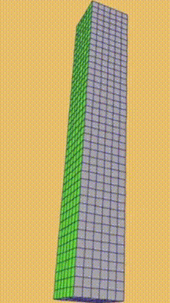
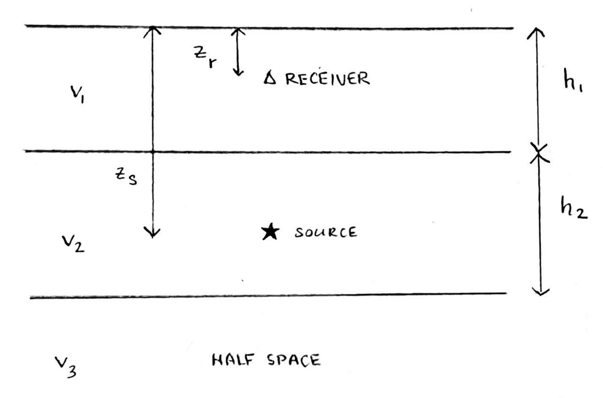
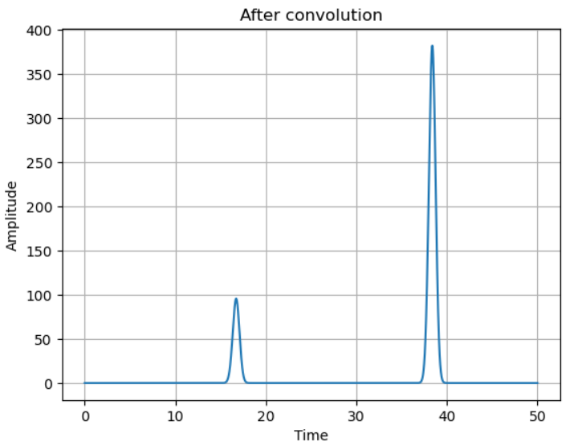

## 2.26_Greens_1D_layers

### Green's function and synthetic seismograms of a 1D layered model

P-waves are a type of seismic wave in which the wave's direction of travel is parallel to the motion of the particles within the wave (i.e., compressional or longitudinal waves). 

    
  
    P-wave. [britannica.com]
  

 The acoustic wave equation describes the propagation of compressional waves in fluids, but is also used to approximately model the propagation of P-waves through rock.

In 1D, the acoustic wave equation is as follows:  

$$\partial_t^2 p(x,t) - c^2 \Delta p(x,t) = s(x,t)$$

 We’ll use this to calculate a synthetic seismogram based on a simple model of a few different layers beneath earth’s surface (the layers are made up of different materials, and therefore seismic waves travel at different speeds through them). At the boundaries between layers, the waves can either be reflected or pass through. Thus we define ray paths, which are each modeled by a delta function (0 everywhere except the layer of interest) called a Green’s function. We sum up the Green’s functions to get a step function of depth vs. time. 

    
      
        Cross-section visualizing the layers.
      

 Next, we model the source of the wave as a point in 2D, using a Gaussian function (so that it looks like a tall “blip” or peak in time). To obtain the earth’s response (i.e., seismogram), we convolve the Green’s function with the source function: 

$$u(x, t) = G(z_{source}, z_{receiver}, t) * s(t)$$

Here is the resulting seismogram:

    

