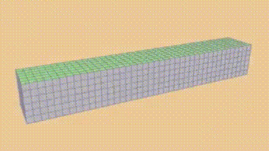
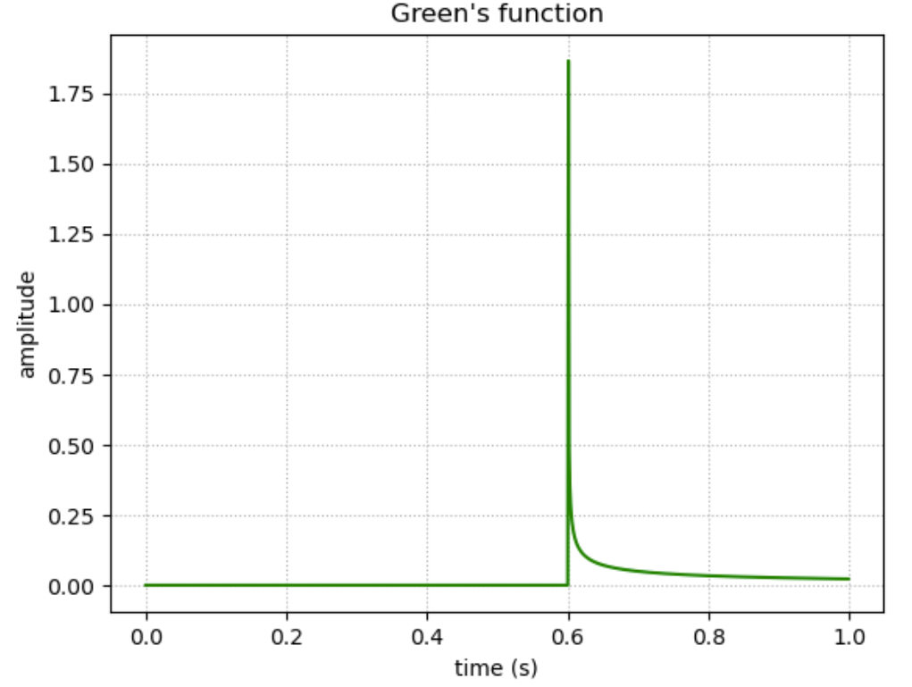
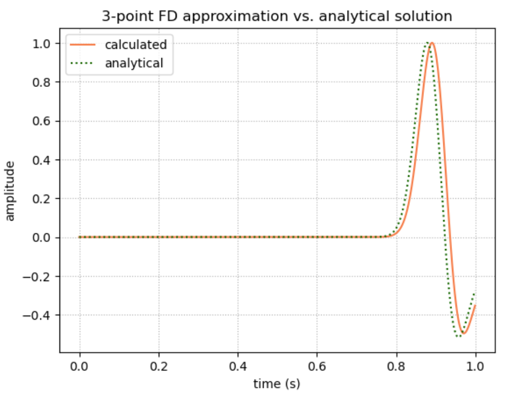

## 4.29_FD_2D_faultzone
### 2D Finite difference simulation of trapped waves in a fault zone

#### Modeling waves using the scalar wave equation

  
  
    Love wave. [britannica.com]
  

In an SH wave, the particle motion is in the horizontal plane and is also perpendicular to the direction of the wave’s travel. For example, a Love wave is a type of SH wave in which the direction of propagation and direction of particle motion are perpendicular to each other, but both lie in the plane of the earth’s surface. 

Another example is an S-wave (a transverse seismic wave) traveling through a plane of cross-section, with particle motion perpendicular to the direction of travel. This is the situation we’ll use in this problem.  

    
  
    S-wave. [britannica.com]
  

 It turns out that in 2D the math behind SH wave propagation is equivalent to that of an acoustic wave, so we can use the acoustic wave equation to model it: 

$$\partial_t^2 p(x, z, t) = c(x, z)^2 (\partial^2_x p(x, z, t) \partial^2_z p(x, z, t)) + s(x, z,t),$$

where we model the source $s(t)$ of the wave as a point in 2D using a rather arbitrary Gaussian function. In this scenario, we can refer to the equation as the scalar wave equation.

#### Finite-difference solution

So, what we have is a second-order partial differential equation in space and time. By manipulating the definition of the derivative, we come up with a "3-point" finite-difference scheme to obtain a numerical solution. (This requires an iterative process of looking one time step forward while simultaneously looking at the neighboring spatial points in two dimensions. See notebook for the math.)

  

#### Comparing the analytical solution

The above equations will determine our numerical solution, but we'd also like to obtain an analytical solution to check our work. To do this, we need to use the established Green's function for the 2D acoustic equation (see exercise for the definition). In 2D, the Green's function is essentially a "spike" with a rapidly attenuating tail. Since we've already defined the source function, we can again get the solution by convolution: 

$$p(t) = G(t) * s(t)$$

    

